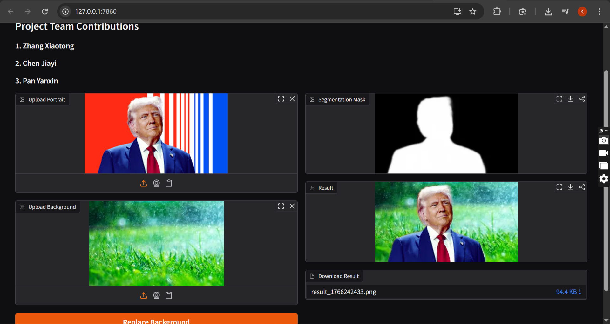

# Portrait Background Separation Using Semantic Segmentation

## Project Title
**Portrait Background Separation Based on Semantic Segmentation**

---

## 1. Project Overview

This project focuses on **portrait background separation**, a common and important task in computer vision and image processing.  
The goal is to accurately segment a human subject from an image and replace the original background with a new one while preserving fine details such as **hair, shoulders, and soft edges**.

The system is built on **deep learning–based semantic segmentation**, combined with **edge refinement and alpha blending** to achieve visually natural results.  
A simple **interactive web demo** is provided using **Gradio**.

This project corresponds to **Topic 4: Title to be chosen by the author** in the final assignment.

---

## 2. Objectives

- Accurately segment human portraits from complex backgrounds
- Preserve fine details (hair strands, contours, soft boundaries)
- Replace backgrounds seamlessly using alpha blending
- Provide an easy-to-use interactive demo
- Build a complete, reproducible segmentation pipeline

---

## 3. Knowledge Points Involved

- Semantic Segmentation
- Deep Learning (CNN-based models)
- Image Preprocessing and Normalization
- Edge Refinement (Bilateral Filter, Morphological Operations)
- Alpha Blending and Image Fusion
- Model Inference and Post-processing
- Interactive UI Development (Gradio)

---

## 4. Methodology

### 4.1 Model Selection

We use **U²-Net**, a deep convolutional neural network specifically designed for **salient object detection and portrait matting**.

**Reasons for choosing U²-Net:**
- Strong performance on human foreground extraction
- Good preservation of hair and fine edges
- Pretrained weights available publicly
- Suitable for real-world portrait segmentation tasks

---

### 4.2 Segmentation Pipeline

1. **Input Image**
   - User uploads a portrait image

2. **Preprocessing**
   - Resize to model input size (320×320)
   - Normalize using ImageNet mean and standard deviation

3. **Model Inference**
   - Forward pass through pretrained U²-Net
   - Obtain raw probability mask

4. **Post-processing**
   - Normalize predicted mask
   - Resize mask back to original image size
   - Edge refinement using:
     - Bilateral filtering
     - Morphological opening & closing
     - Gaussian feathering

5. **Background Replacement**
   - Alpha blending using the refined mask
   - Composite foreground onto a new background image

---

---

## 5. Environment Requirements

### 5.1 Software

- Operating System: Windows / Linux / macOS
- Python ≥ 3.8
- CUDA (optional, for GPU acceleration)

---

### 5.2 Python Dependencies

install dependencies:
 `pip install -r requirements.txt`

## 6. Pretrained Model

- **U²-Net Pretrained Weights**
- **Model:** U²-Net
- **File:** `u2net.pth`
- **Download link:**  
  https://github.com/LeCongThuong/U2Net?tab=readme-ov-file

After downloading, place the pretrained model file in the project root directory.

## 7. How to Run the Project

### Step 1: Install Dependencies
 `pip install -r requirements.txt`

### Step 2: Run the Application
 `python app.py`

### Step 3: Open the Web Interface
Open your browser and visit:
`http://127.0.0.1:7860 `

### An Example of the UI

## Step 4: Use the Demo
 - Upload a portrait image
- Upload a background image
- Click Replace Background
- View the segmentation mask and final output

## 8. Experimental Results
 - The system successfully separates the human subject from complex backgrounds
 - Hair and fine edges are preserved using edge-aware refinement
 - Background replacement appears natural with smooth transitions
 - Works best for clear portrait images with visible human subjects

## 9. Project Team Contributions
### 1. Zhang Xiaotong — Model Research & Segmentation Pipeline
 - Research and implementation of DeepLabv3+ and U²-Net
 - Model testing and segmentation accuracy analysis
 - Foreground mask generation and edge refinement strategies
 - Ensuring segmentation quality and stability

### 2. Chen Jiayi — Background Fusion & System Integration
 - Alpha blending and background fusion algorithms
 - Color and size consistency between foreground and background
 - End-to-end pipeline integration
 - Final output generation

### 3. Pan Yanxin — UI Demo, Dataset & Evaluation
 - Gradio-based interactive demo development
 - Experimental visualization and result presentation
 - Performance evaluation and analysis